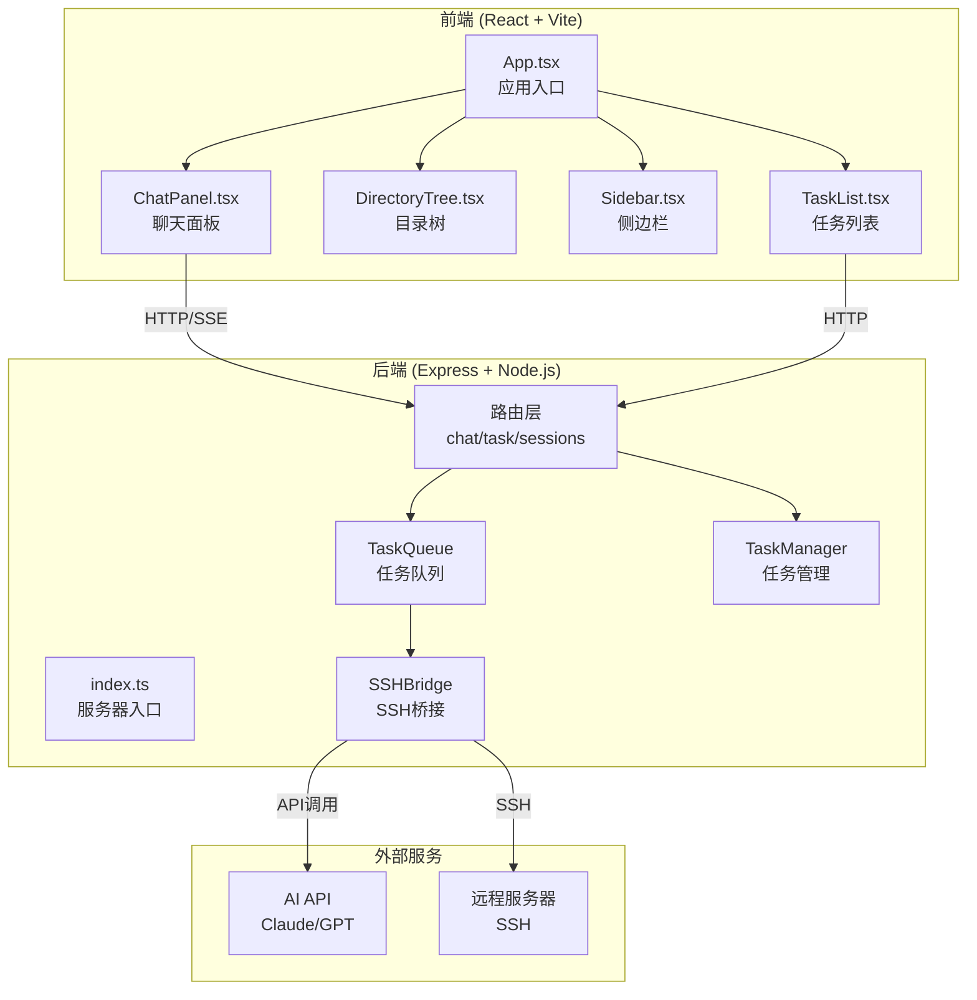
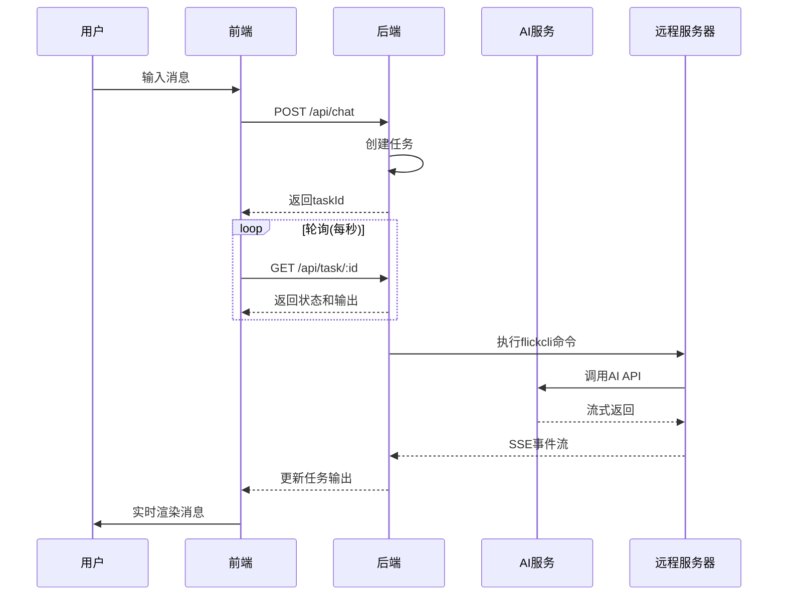
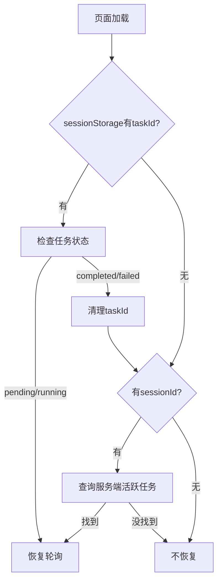
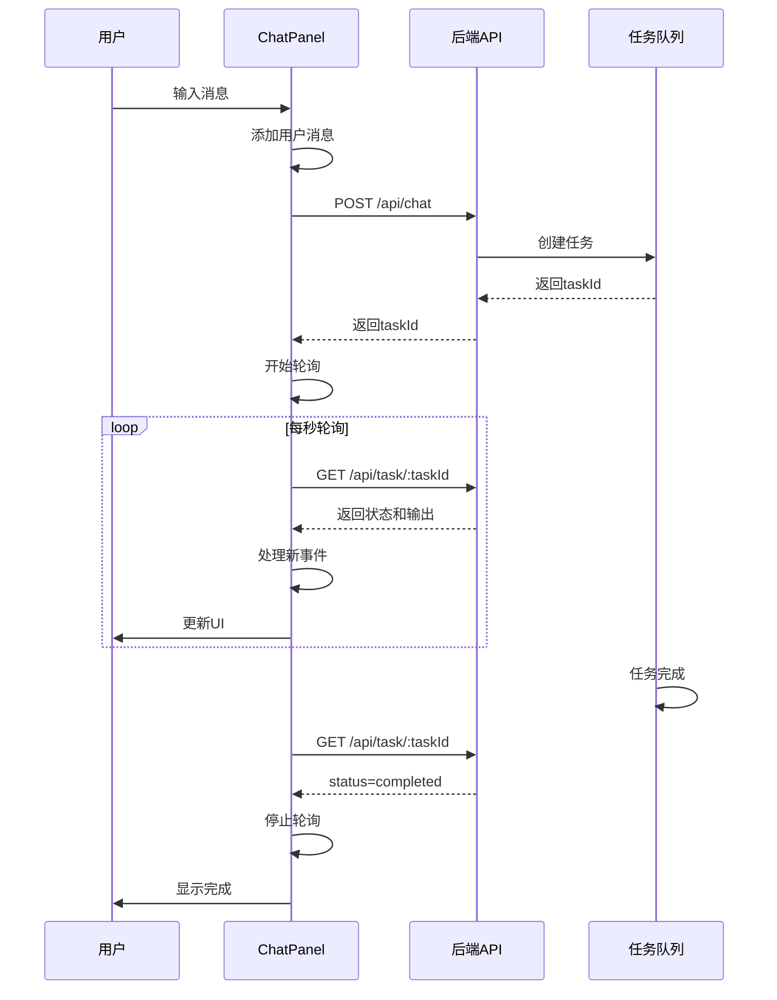
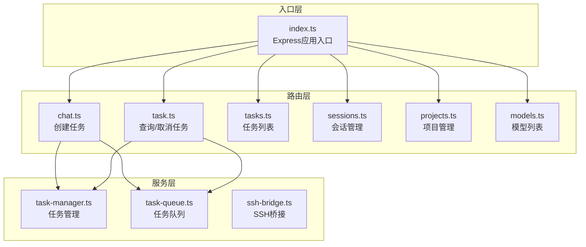
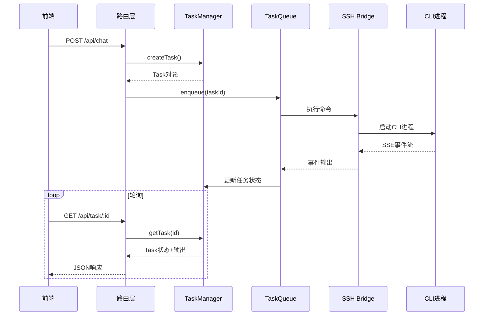
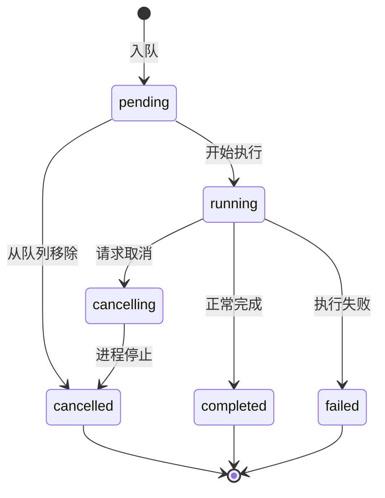
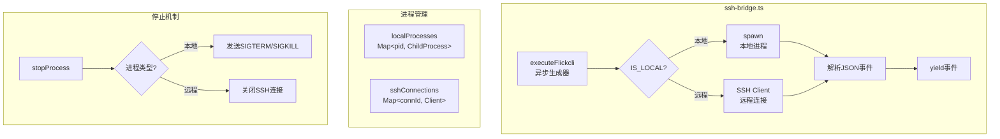
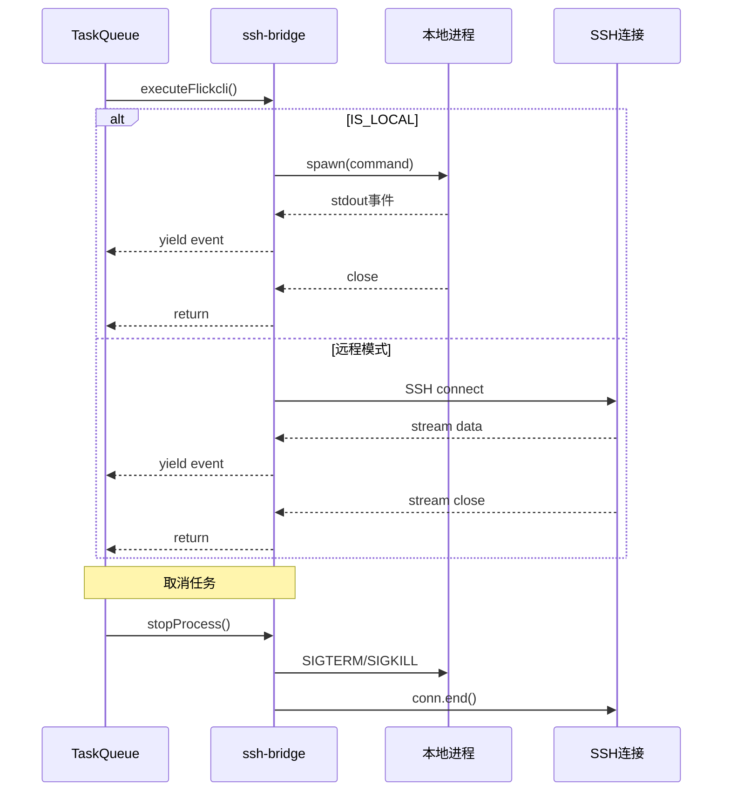

# WebClaw AI编程助手 - 项目完整讲解

> 本文档包含项目的完整逐行讲解，适合面试前复习使用。

---

## 目录

1. [项目整体架构](#1-项目整体架构)
2. [前端核心类型系统 - types.ts](#2-前端核心类型系统---typests)
3. [前端入口组件 - App.tsx](#3-前端入口组件---apptsx)
4. [核心聊天组件 - ChatPanel.tsx](#4-核心聊天组件---chatpaneltsx)
5. [目录树组件 - DirectoryTree.tsx](#5-目录树组件---directorytreetsx)
6. [后端架构](#6-后端架构)
7. [任务队列系统 - task-queue.ts](#7-任务队列系统---task-queuets)
8. [SSH桥接 - ssh-bridge.ts](#8-ssh桥接---ssh-bridgets)
9. [面试核心要点总结](#9-面试核心要点总结)

---

## 1. 项目整体架构

### 1.1 项目定位

这是一个 **AI编程助手**，类似简化版的 GitHub Copilot / Cursor。

**核心功能：**
- 聊天界面与AI交互
- 读取文件、执行命令、修改代码
- 远程SSH连接执行任务
- 实时流式渲染AI回复
- 任务队列管理 + 并发控制

### 1.2 技术架构

| 层级 | 技术栈 |
|------|--------|
| 前端 | React 19 + TypeScript 5.x + Vite 7 + Tailwind CSS v4 |
| 后端 | Node.js + Express + TypeScript + ssh2 |
| 外部服务 | AI API、远程服务器(SSH) |

### 1.3 整体架构图



### 1.4 数据流向



---

## 2. 前端核心类型系统 - types.ts

### 2.1 文件位置
`client/src/lib/types.ts`

### 2.2 核心类型定义

#### 事件类型（SSE流式传输）

```typescript
// 初始化事件 - CLI启动时发送
export interface FlickcliInitEvent {
  type: "system";
  subtype: "init";
  sessionId: string;   // 会话ID
  model: string;       // 使用的模型
  cwd: string;         // 工作目录
  tools: string[];     // 可用工具列表
}

// 工具调用事件 - AI决定调用工具时发送
export interface FlickcliToolUse {
  type: "tool_use";
  id: string;          // 工具调用ID
  name: string;        // 工具名称（如read_file, execute_command）
  input: Record<string, unknown>;  // 工具参数
}

// 工具结果事件 - 工具执行完成后发送
export interface FlickcliToolResult {
  type: "tool-result";
  toolCallId: string;  // 对应的tool_use ID
  toolName: string;
  input: Record<string, unknown>;
  result: {
    returnDisplay: string;  // 给用户看的展示内容
    llmContent: string;     // 给AI看的内容
    truncated: boolean;     // 是否被截断
  };
}

// 消息事件 - AI回复的核心事件
export interface FlickcliMessageEvent {
  type: "message";
  role: "assistant" | "tool";
  uuid: string;        // 消息唯一ID
  parentUuid: string;  // 父消息ID
  content: Array<      // 内容数组，支持混合类型
    | { type: string; text?: string }
    | FlickcliToolUse
    | FlickcliToolResult
  >;
  text: string;
  model: string;
  usage: { input_tokens: number; output_tokens: number };
  timestamp: string;
  sessionId: string;
}

// 结果事件 - 任务最终结果
export interface FlickcliResultEvent {
  type: "result";
  subtype: "success" | "error";
  isError: boolean;
  content: string;
  sessionId: string;
  usage: { input_tokens: number; output_tokens: number };
}

// 联合类型 - 通过type字段区分
export type FlickcliEvent =
  | FlickcliInitEvent
  | FlickcliMessageEvent
  | FlickcliResultEvent
  | FlickcliMetaEvent;
```

#### 业务类型

```typescript
// 会话元数据
export interface SessionMeta {
  id: string;
  updatedAt: string;
  isSubAgent: boolean;
}

// 聊天消息
export interface ChatMessage {
  id: string;
  role: "user" | "assistant" | "tool";
  content: string;
  toolCalls?: Array<{
    id: string;
    name: string;
    input: Record<string, unknown>;
    result?: string;  // 工具执行结果
  }>;
  timestamp: string;
  tokens?: { input: number; output: number };
  command?: string;  // 展示对应的CLI命令
}

// 模型信息
export interface ModelInfo {
  id: string;
  label: string;
  desc?: string;
  group: string;  // KAT, Claude, Gemini, GPT, Other
}

// 聊天模式
export type ChatMode = "agent" | "plan" | "ask";

export const CHAT_MODES = [
  { id: "agent" as ChatMode, label: "智能体", icon: "∞", desc: "完整能力，可读写编辑执行" },
  { id: "plan" as ChatMode, label: "计划", icon: "☰", desc: "只读分析，输出实现计划" },
  { id: "ask" as ChatMode, label: "问答", icon: "💬", desc: "头脑风暴，纯对话不改代码" },
] as const;

// 审批模式
export const APPROVAL_MODES = [
  { id: "default", label: "安全模式", icon: "🛡️", desc: "操作需确认" },
  { id: "autoEdit", label: "自动编辑", icon: "✏️", desc: "编辑自动，bash需确认" },
  { id: "yolo", label: "YOLO", icon: "🚀", desc: "全部自动执行" },
] as const;
```

#### 任务系统类型

```typescript
// 任务状态
export type TaskStatus = 
  | "pending"     // 等待执行
  | "running"     // 正在执行
  | "completed"   // 已完成
  | "failed"      // 失败
  | "cancelling"  // 正在取消
  | "cancelled";  // 已取消

// 进程信息
export interface ProcessInfo {
  type: "local" | "remote";
  pid?: number;           // 本地进程ID
  sshConnId?: string;     // SSH连接ID
  killable: boolean;      // 是否可终止
}

// 任务
export interface Task {
  id: string;
  sessionId: string | null;
  project: string;
  message: string;
  model?: string;
  status: TaskStatus;
  output: FlickcliEvent[];  // 输出事件数组
  createdAt: number;
  startedAt?: number;
  completedAt?: number;
  error?: string;
  approvalMode?: string;
  chatMode?: ChatMode;
  advancedOpts?: Record<string, unknown>;
  processInfo?: ProcessInfo;
  cancellationRequested?: boolean;
}

// 任务队列状态
export interface TaskQueueState {
  queue: string[];    // 待执行任务ID列表
  running: string[];  // 正在执行的任务ID列表
}
```

### 2.3 TypeScript关键语法

#### 联合类型 + 类型守卫

```typescript
// 通过type字段区分不同事件
function processEvent(event: FlickcliEvent) {
  if (event.type === "system") {
    // TypeScript知道这里event是FlickcliInitEvent
    console.log(event.sessionId);
  } else if (event.type === "message") {
    // TypeScript知道这里event是FlickcliMessageEvent
    console.log(event.content);
  }
}
```

#### 常量断言 `as const`

```typescript
const CHAT_MODES = [
  { id: "agent", label: "智能体" },
] as const;

// 效果：数组变为只读，类型变为字面量类型
// { readonly id: "agent"; readonly label: "智能体" }
```

---

## 3. 前端入口组件 - App.tsx

### 3.1 文件位置
`client/src/App.tsx`

### 3.2 核心代码讲解

#### 导入与类型定义

```typescript
import { useState, useEffect, useCallback, useRef } from "react";
import { Sidebar } from "@/components/Sidebar";
import { ChatPanel } from "@/components/ChatPanel";
import { TaskList } from "@/components/TaskList";
import type { AdvancedOpts } from "@/components/ChatPanel";
import { ConfigModal } from "@/components/ConfigModal";
import { BASE_PATH, FALLBACK_MODELS } from "@/lib/types";
import type { SessionMeta, ChatMode, ModelInfo } from "@/lib/types";
import type { TreeNode } from "@/components/DirectoryTree";

interface Project {
  name: string;
  path: string;
}

type ViewMode = "tasks" | "chat";
```

**面试点：路径别名 `@/`**

在Vite中配置，`@/` 映射到 `src/`，避免相对路径地狱：
```typescript
// 不使用别名
import { Sidebar } from "../components/Sidebar";
import { ChatPanel } from "../components/ChatPanel";

// 使用别名
import { Sidebar } from "@/components/Sidebar";
import { ChatPanel } from "@/components/ChatPanel";
```

#### 工具函数 loadSaved

```typescript
function loadSaved<T>(key: string, fallback: T): T {
  // SSR安全检查
  if (typeof window === "undefined") return fallback;
  try {
    const v = localStorage.getItem(key);
    // 类型安全的泛型返回
    return v !== null ? JSON.parse(v) : fallback;
  } catch {
    // 错误处理：解析失败返回默认值
    return fallback;
  }
}
```

**理解：** 这是一个泛型工具函数，用于从 localStorage 读取数据。三个关键点：
1. **SSR安全检查** - 服务端渲染时window不存在
2. **类型安全** - 泛型T保证返回类型正确
3. **错误处理** - try-catch确保解析失败不崩溃

#### 状态管理

```typescript
export default function App() {
  // 视图模式 - 惰性初始化
  const [viewMode, setViewMode] = useState<ViewMode>(() => {
    const savedView = loadSaved("kwaicli_view", "tasks");
    const savedSession = loadSaved("kwaicli_session", null);
    // 如果有保存的session，应该显示chat视图
    return savedSession ? "chat" : savedView;
  });
  
  const [projects, setProjects] = useState<Project[]>([]);
  const [selectedProject, setSelectedProject] = useState(() => 
    loadSaved("kwaicli_project", "")
  );
  const [sessions, setSessions] = useState<SessionMeta[]>([]);
  const [selectedSession, setSelectedSession] = useState<string | null>(() => 
    loadSaved("kwaicli_session", null)
  );
  const [model, setModel] = useState(() => 
    loadSaved("kwaicli_model", "claude-4.5-sonnet")
  );
  const [approvalMode, setApprovalMode] = useState("default");
  const [chatMode, setChatMode] = useState<ChatMode>("agent");
  const [availableModels, setAvailableModels] = useState<ModelInfo[]>(FALLBACK_MODELS);
  const [treeData, setTreeData] = useState<TreeNode[]>([]);
  
  // ... 其他状态
}
```

**面试点：惰性初始化**

```typescript
// 普通初始化 - 每次渲染都会执行loadSaved
const [value, setValue] = useState(loadSaved("key", "default"));

// 惰性初始化 - 只在首次渲染执行一次
const [value, setValue] = useState(() => loadSaved("key", "default"));
```

#### 数据加载

```typescript
useEffect(() => {
  console.log("[App.tsx] Fetching projects, BASE_PATH:", BASE_PATH);
  setLoadingProjects(true);
  
  // 请求超时处理
  const timeoutId = setTimeout(() => {
    console.error("[App.tsx] Request timeout!");
    setLoadingProjects(false);
    alert("加载超时！请检查网络或刷新页面");
  }, 15000);
  
  // 获取项目树状结构
  fetch(`${BASE_PATH}/api/projects?tree=true`)
    .then((r) => {
      clearTimeout(timeoutId);
      return r.json();
    })
    .then((data) => {
      // 保存原始树数据
      if (data.tree) {
        setTreeData(data.tree);
        
        // 将树展平为列表
        const flattenTree = (nodes) => {
          let result = [];
          for (const node of nodes) {
            result.push({ name: node.name, path: node.path });
            if (node.children) {
              result = result.concat(flattenTree(node.children));
            }
          }
          return result;
        };
        setProjects(flattenTree(data.tree));
      }
    })
    .finally(() => setLoadingProjects(false));

  // 并行加载可用模型列表
  fetch(`${BASE_PATH}/api/models`)
    .then((r) => r.ok ? r.json() : null)
    .then((data) => {
      if (data?.models?.length) setAvailableModels(data.models);
    })
    .catch(() => { /* 失败时保持FALLBACK_MODELS */ });
}, []);  // 空依赖数组 = 只执行一次
```

**面试点：useEffect依赖数组**

| 依赖数组 | 行为 |
|----------|------|
| `[]` | 只在组件挂载时执行一次 |
| `[dep]` | dep变化时执行 |
| 不传 | 每次渲染都执行 |

**面试点：请求超时处理**

原生fetch没有超时功能，用setTimeout实现：
```typescript
const timeoutId = setTimeout(() => {
  // 超时处理
}, 15000);

fetch(url)
  .then((r) => {
    clearTimeout(timeoutId);  // 成功时清除超时
    return r.json();
  });
```

#### 强制重新挂载组件

```typescript
const mountCounter = useRef(0);
const [chatKey, setChatKey] = useState("init");

const remountChat = useCallback(() => {
  mountCounter.current += 1;
  setChatKey(`mount-${mountCounter.current}`);
}, []);

// 在JSX中使用key
<ChatPanel key={chatKey} ... />
```

**理解：** 当 `key` 变化时，React会销毁旧组件并创建新组件，相当于强制重新挂载。这用于重置ChatPanel的状态。

#### 状态持久化

```typescript
// 每次状态变化自动保存到localStorage
useEffect(() => {
  localStorage.setItem("kwaicli_view", JSON.stringify(viewMode));
}, [viewMode]);

useEffect(() => {
  localStorage.setItem("kwaicli_project", JSON.stringify(selectedProject));
}, [selectedProject]);

useEffect(() => {
  localStorage.setItem("kwaicli_session", JSON.stringify(selectedSession));
}, [selectedSession]);

useEffect(() => {
  localStorage.setItem("kwaicli_model", JSON.stringify(model));
}, [model]);
```

#### 响应式设计

```typescript
return (
  <main className="h-dvh flex bg-zinc-950 relative overflow-hidden">
    {/* Mobile sidebar overlay - 移动端遮罩层 */}
    {sidebarOpen && (
      <div
        className="fixed inset-0 bg-black/60 z-40 md:hidden"
        onClick={() => setSidebarOpen(false)}
      />
    )}

    {/* Sidebar - 移动端滑入滑出 */}
    <div className={`
      fixed inset-y-0 left-0 z-50 transform transition-transform duration-200 
      ease-in-out md:relative md:translate-x-0 md:z-auto
      ${sidebarOpen ? "translate-x-0" : "-translate-x-full"}
    `}>
      <Sidebar ... />
    </div>

    {/* 主内容区 */}
    <div className="flex-1 min-w-0">
      {viewMode === "tasks" ? (
        <TaskList ... />
      ) : (
        <ChatPanel key={chatKey} ... />
      )}
    </div>
  </main>
);
```

**面试点：响应式设计技巧**

- `h-dvh` - 动态视口高度，移动端友好（考虑地址栏）
- `md:hidden` - 中等屏幕以上隐藏
- `md:relative md:translate-x-0` - 中等屏幕以上恢复默认位置
- `transition-transform duration-200` - 200ms过渡动画

---

## 4. 核心聊天组件 - ChatPanel.tsx

### 4.1 文件位置
`client/src/components/ChatPanel.tsx`（1296行）

### 4.2 整体结构

ChatPanel是整个项目最核心的组件，负责：
1. 消息发送和接收
2. 任务轮询和状态管理
3. 历史记录恢复
4. 任务断点续传
5. 消息渲染

### 4.3 核心代码讲解

#### 类型定义和Props

```typescript
export interface AdvancedOpts {
  planModel: string;
  smallModel: string;
  visionModel: string;
  systemPrompt: string;
  appendSystemPrompt: string;
  language: string;
  browser: boolean;
  thinkingLevel: string;
  notificationEnabled: boolean;
  notificationRobotKey: string;
}

interface ChatPanelProps {
  selectedProject: string;
  initialSessionId: string | null;
  model: string;
  approvalMode: string;
  chatMode: ChatMode;
  advancedOpts: AdvancedOpts;
  availableModels: ModelInfo[];
  onModelChange: (m: string) => void;
  onApprovalModeChange: (m: string) => void;
  onChatModeChange: (m: ChatMode) => void;
  onAdvancedOptsChange: (opts: Partial<AdvancedOpts>) => void;
  onSessionCreated: (id: string) => void;
  onToggleSidebar?: () => void;
  onBackToTasks?: () => void;
}
```

#### 状态定义

```typescript
const [messages, setMessages] = useState<ChatMessage[]>([]);
const [input, setInput] = useState("");
const [isLoading, setIsLoading] = useState(false);
const [sessionId, setSessionId] = useState<string | null>(initialSessionId);
const [sessionInfo, setSessionInfo] = useState<{
  model?: string;
  tools?: string[];
  cwd?: string;
}>({});

// Refs - 用于持久化引用，不触发重渲染
const messagesEndRef = useRef<HTMLDivElement>(null);    // 自动滚动
const textareaRef = useRef<HTMLTextAreaElement>(null);  // 输入框
const abortControllerRef = useRef<AbortController | null>(null);
const pollIntervalRef = useRef<ReturnType<typeof setInterval> | null>(null);
const lastOutputIndexRef = useRef(0);  // 已处理的输出索引（增量更新）
```

**面试点：useState vs useRef**

| 特性 | useState | useRef |
|------|----------|--------|
| 更新时 | 触发重渲染 | 不触发重渲染 |
| 用途 | UI状态 | DOM引用、持久化值 |
| 初始值 | 每次渲染获取 | 只在首次渲染获取 |

#### 核心轮询机制 ⭐⭐⭐

```typescript
// 停止轮询
const stopPolling = useCallback(() => {
  if (pollIntervalRef.current) {
    clearInterval(pollIntervalRef.current);
    pollIntervalRef.current = null;
  }
}, []);

// 启动轮询
const startPolling = useCallback((taskId: string) => {
  console.log(`[ChatPanel] startPolling called for task: ${taskId}`);
  
  // 清除之前的轮询（防止重复轮询）
  if (pollIntervalRef.current) {
    clearInterval(pollIntervalRef.current);
  }

  // pendingToolCalls: 存储待处理的工具调用
  const pendingToolCalls: Map<
    string,
    { name: string; input: Record<string, unknown> }
  > = new Map();

  const pollTask = async () => {
    try {
      // 1. 获取任务状态
      const res = await fetch(`${BASE_PATH}/api/task/${taskId}`);
      const data = await res.json();
      const { status, output, error } = data;

      // 2. 增量处理新事件（关键优化！）
      const newEvents = output.slice(lastOutputIndexRef.current);
      lastOutputIndexRef.current = output.length;

      // 3. 处理每个新事件
      for (const event of newEvents) {
        processEvent(event, setMessages, ...);
      }

      // 4. 根据任务状态决定是否继续轮询
      if (status === "completed") {
        stopPolling();
        setIsLoading(false);
        persistTaskId(null);
      } else if (status === "failed") {
        stopPolling();
        setMessages((prev) => [...prev, {
          id: `err-${Date.now()}`,
          role: "assistant",
          content: `❌ 任务失败: ${error || "未知错误"}`,
          timestamp: new Date().toISOString(),
        }]);
        setIsLoading(false);
      } else if (status === "cancelled") {
        stopPolling();
        setIsLoading(false);
      }
    } catch (err) {
      // 轮询错误不停止，继续重试
      console.error("[Poll] Error:", err);
    }
  };

  // 立即执行一次
  pollTask();

  // 每秒轮询一次
  pollIntervalRef.current = setInterval(pollTask, 1000);
}, [onSessionCreated, persistTaskId]);
```

**面试问题：为什么用轮询而不是WebSocket/SSE？**

**回答：**
1. **简单可靠** - 轮询只需要HTTP请求，不需要额外的连接管理
2. **任务队列场景适合** - 任务执行时间较长（几秒到几分钟），1秒轮询足够
3. **断点续传** - 任务ID持久化到sessionStorage，页面刷新后可以恢复
4. **降级友好** - 轮询失败可以继续重试，不会丢失数据

**面试问题：增量更新的原理是什么？**

**回答：**
```typescript
const newEvents = output.slice(lastOutputIndexRef.current);
lastOutputIndexRef.current = output.length;
```

- `lastOutputIndexRef.current` 记录已处理的事件数量
- 每次轮询只获取 `slice(已处理索引)` 的新事件
- 避免重复处理已显示的事件

#### 闭包问题的解决方案 ⭐⭐⭐

```typescript
// 用ref保存startPolling的最新引用
const startPollingRef = useRef(startPolling);
startPollingRef.current = startPolling;
```

**面试点：React闭包陷阱**

**问题描述：**
当 `useEffect` 依赖了某个函数，而这个函数内部使用了状态，函数会在每次渲染时重新创建，导致 `useEffect` 重复执行。

**解决方案：**
```typescript
// 错误写法
useEffect(() => {
  startPolling(taskId);  // startPolling每次渲染都是新函数
}, [startPolling]);  // 导致无限循环

// 正确写法
const startPollingRef = useRef(startPolling);
startPollingRef.current = startPolling;  // 每次渲染更新ref

useEffect(() => {
  startPollingRef.current(taskId);  // 使用ref.current
}, [taskId]);  // 只依赖taskId，不会无限循环
```

#### 任务恢复机制 ⭐⭐⭐

```typescript
const taskRecoveryRan = useRef(false);  // 确保只执行一次

useEffect(() => {
  // 1. 防止重复执行
  if (taskRecoveryRan.current) return;
  if (!selectedProject) return;
  taskRecoveryRan.current = true;

  // 恢复任务的函数
  function resumeTask(taskId: string, source: string) {
    setIsLoading(true);
    persistTaskId(taskId);
    lastOutputIndexRef.current = 0;
    startPollingRef.current(taskId);
  }

  // 2. 优先从sessionStorage恢复
  const savedTaskId = sessionStorage.getItem("kwaicli_currentTaskId");
  if (savedTaskId) {
    fetch(`${BASE_PATH}/api/task/${savedTaskId}`)
      .then((r) => r.json())
      .then((data) => {
        if (data.status === "pending" || data.status === "running") {
          resumeTask(savedTaskId, "sessionStorage");
        } else {
          persistTaskId(null);
          checkSessionTasks();
        }
      });
    return;
  }

  // 3. 没有sessionStorage，检查服务端是否有活跃任务
  checkSessionTasks();

  function checkSessionTasks() {
    if (!initialSessionId) return;
    fetch(`${BASE_PATH}/api/tasks?sessionId=${initialSessionId}`)
      .then((r) => r.json())
      .then((data) => {
        const runningTask = data.tasks?.find((task) =>
          task.sessionId === initialSessionId &&
          (task.status === "pending" || task.status === "running")
        );
        if (runningTask) {
          resumeTask(runningTask.id, "server-query");
        }
      });
  }
}, [initialSessionId, selectedProject, persistTaskId]);
```

**任务恢复流程图：**



**三层恢复机制：**
1. **sessionStorage** - 页面刷新后首先检查
2. **服务端查询** - 没有本地记录时查询服务端
3. **历史加载** - 加载已完成的会话历史

#### handleSubmit 发送消息

```typescript
const handleSubmit = async (e?: React.FormEvent) => {
  e?.preventDefault();
  const trimmed = input.trim();
  if (!trimmed || isLoading) return;

  // 1. 双重检查：确保没有正在执行的任务
  if (sessionId) {
    const checkRes = await fetch(`${BASE_PATH}/api/tasks?sessionId=${sessionId}`);
    const checkData = await checkRes.json();
    const hasRunningTask = checkData.tasks?.some((task) =>
      task.status === "pending" || task.status === "running"
    );
    if (hasRunningTask) {
      alert("该会话已有任务正在执行中");
      return;
    }
  }

  // 2. 添加用户消息到列表
  const userMsg: ChatMessage = {
    id: `user-${Date.now()}`,
    role: "user",
    content: trimmed,
    timestamp: new Date().toISOString(),
  };
  setMessages((prev) => [...prev, userMsg]);
  setInput("");
  setIsLoading(true);
  lastOutputIndexRef.current = 0;

  try {
    // 3. 创建任务
    const res = await fetch(`${BASE_PATH}/api/chat`, {
      method: "POST",
      headers: { "Content-Type": "application/json" },
      body: JSON.stringify({
        message: trimmed,
        sessionId: sessionId || undefined,
        cwd: selectedProject || undefined,
        model: model || undefined,
        // ... 高级选项
      }),
    });

    // 4. 处理409冲突（已有活跃任务）
    if (res.status === 409) {
      const errData = await res.json();
      setIsLoading(true);
      persistTaskId(errData.activeTaskId);
      startPolling(errData.activeTaskId);
      setMessages((prev) => prev.filter((m) => m.id !== userMsg.id));
      return;
    }

    const data = await res.json();
    const taskId = data.taskId;

    // 5. 更新sessionId（新会话时）
    if (data.sessionId && !sessionId) {
      setSessionId(data.sessionId);
      onSessionCreated(data.sessionId);
    }

    // 6. 开始轮询
    persistTaskId(taskId);
    startPolling(taskId);
  } catch (error) {
    setMessages((prev) => [...prev, {
      id: `err-${Date.now()}`,
      role: "assistant",
      content: `❌ 错误: ${error.message}`,
      timestamp: new Date().toISOString(),
    }]);
    setIsLoading(false);
  }
};
```

**面试问题：为什么用任务ID而不是直接等待响应？**

**回答：**
1. **解耦** - 前端不需要保持长连接
2. **可恢复** - 任务ID可以持久化，页面刷新后恢复
3. **可取消** - 可以通过API取消任务
4. **并发控制** - 后端可以限制同时运行的任务数

#### processEvent 事件处理 ⭐⭐⭐

```typescript
function processEvent(
  event: FlickcliEvent,
  setMessages: React.Dispatch<React.SetStateAction<ChatMessage[]>>,
  onSession: (id: string) => void,
  setSessionInfo: React.Dispatch<...>,
  pendingToolCalls: Map<string, { name: string; input: Record<string, unknown> }>
) {
  // 1. 处理meta事件（命令信息）
  if (event.type === "meta" && "command" in event) {
    setMessages((prev) => {
      const last = prev[prev.length - 1];
      if (last && last.role === "user") {
        const updated = [...prev];
        updated[updated.length - 1] = { ...last, command: event.command };
        return updated;
      }
      return prev;
    });
    return;
  }

  // 2. 处理system/init事件
  if (event.type === "system" && "subtype" in event) {
    onSession(event.sessionId);
    setSessionInfo({
      model: event.model,
      tools: event.tools,
      cwd: event.cwd,
    });
    return;
  }

  // 3. 处理assistant消息（核心）
  if (event.type === "message" && event.role === "assistant") {
    const toolCalls: ChatMessage["toolCalls"] = [];
    let textContent = "";

    for (const item of event.content) {
      if (item.type === "text") {
        textContent = item.text;
      } else if (item.type === "tool_use") {
        pendingToolCalls.set(item.id, { name: item.name, input: item.input });
        toolCalls.push({
          id: item.id,
          name: item.name,
          input: item.input,
        });
      }
    }

    if (textContent || toolCalls.length > 0) {
      setMessages((prev) => {
        const idx = prev.findIndex((m) => m.id === event.uuid);
        const newMsg: ChatMessage = {
          id: event.uuid,
          role: "assistant",
          content: textContent,
          toolCalls: toolCalls.length > 0 ? toolCalls : undefined,
          timestamp: event.timestamp,
          tokens: event.usage
            ? { input: event.usage.input_tokens, output: event.usage.output_tokens }
            : undefined,
        };
        
        if (idx >= 0) {
          // 已存在：合并内容
          const existing = prev[idx];
          const merged: ChatMessage = {
            ...existing,
            content: textContent || existing.content,
            toolCalls: toolCalls.length > 0
              ? [...(existing.toolCalls || []), ...toolCalls]
              : existing.toolCalls,
            tokens: newMsg.tokens || existing.tokens,
          };
          const updated = [...prev];
          updated[idx] = merged;
          return updated;
        }
        return [...prev, newMsg];
      });
    }
    return;
  }

  // 4. 处理tool消息（工具结果）
  if (event.type === "message" && event.role === "tool") {
    for (const item of event.content) {
      if (item.type === "tool-result") {
        setMessages((prev) =>
          prev.map((msg) => {
            if (!msg.toolCalls) return msg;
            const updated = msg.toolCalls.map((tc) =>
              tc.id === item.toolCallId
                ? { ...tc, result: item.result.returnDisplay }
                : tc
            );
            return { ...msg, toolCalls: updated };
          })
        );
      }
    }
  }
}
```

**面试问题：消息合并的逻辑是什么？**

**回答：**
由于流式传输，同一消息可能多次更新：
1. 首先检查消息是否已存在（通过uuid）
2. 如果存在，合并新内容和旧内容
3. 如果不存在，添加新消息

**面试问题：pendingToolCalls的作用？**

**回答：**
工具调用分两步：
1. AI发送 `tool_use` 事件（我要调用工具）
2. 工具执行后发送 `tool-result` 事件（执行结果）

`pendingToolCalls` 用于暂存第一步的信息，等第二步到来时匹配并更新结果。

#### ChatPanel 数据流图



---

## 5. 目录树组件 - DirectoryTree.tsx

### 5.1 文件位置
`client/src/components/DirectoryTree.tsx`（114行）

### 5.2 核心代码讲解

#### 类型定义

```typescript
export interface TreeNode {
  name: string;
  path: string;
  children?: TreeNode[];
  isExpanded?: boolean;
}

interface DirectoryTreeProps {
  node: TreeNode;
  level: number;          // 层级深度，用于计算缩进
  selectedPath: string;
  onSelect: (path: string) => void;
  onToggle?: (path: string) => void;
}
```

#### 递归组件实现

```typescript
export function DirectoryTreeNode({
  node,
  level,
  selectedPath,
  onSelect,
  onToggle,
}: DirectoryTreeProps) {
  // 展开状态
  const [isExpanded, setIsExpanded] = useState(node.isExpanded ?? false);
  const hasChildren = node.children && node.children.length > 0;
  const isSelected = selectedPath === node.path;

  // 切换展开/折叠
  const handleToggle = (e: React.MouseEvent) => {
    e.stopPropagation();  // 阻止事件冒泡
    setIsExpanded(!isExpanded);
    onToggle?.(node.path);
  };

  // 选择目录
  const handleSelect = () => {
    onSelect(node.path);
  };

  return (
    <div>
      <button
        onClick={handleSelect}
        className={`... ${isSelected ? "bg-blue-600/20 text-blue-400" : "..."}`}
        style={{ paddingLeft: `${level * 12 + 8}px` }}  // 层级缩进
        title={node.path}
      >
        {/* 展开/折叠按钮 */}
        {hasChildren ? (
          <span onClick={handleToggle}>
            {isExpanded ? "▼" : "▶"}
          </span>
        ) : (
          <span className="w-4" />  // 占位，保持对齐
        )}
        
        {/* 文件夹图标 */}
        <span>{isExpanded && hasChildren ? "📂" : "📁"}</span>
        
        {/* 目录名 */}
        <span className="flex-1 truncate">{node.name}</span>
      </button>

      {/* 子节点 - 递归调用 */}
      {isExpanded && hasChildren && (
        <div>
          {node.children!.map((child) => (
            <DirectoryTreeNode
              key={child.path}
              node={child}
              level={level + 1}  // 层级+1
              selectedPath={selectedPath}
              onSelect={onSelect}
              onToggle={onToggle}
            />
          ))}
        </div>
      )}
    </div>
  );
}
```

**面试点：递归组件三要素**

1. **组件调用自身** - `DirectoryTreeNode` 内部调用 `DirectoryTreeNode`
2. **终止条件** - `hasChildren` 为 false 时不再递归
3. **状态传递** - `level + 1` 传递给子节点

**面试点：`??` 空值合并运算符**

```typescript
node.isExpanded ?? false
```

与 `||` 的区别：
- `||` - 左侧为假值（0, "", false, null, undefined）时返回右侧
- `??` - 左侧为 `null` 或 `undefined` 时返回右侧

**面试点：`stopPropagation`**

```typescript
handleToggle = (e: React.MouseEvent) => {
  e.stopPropagation();  // 阻止事件冒泡
  // ...
}
```

防止展开按钮的点击事件冒泡到父级button，触发handleSelect。

#### 包装组件

```typescript
interface DirectoryTreeListProps {
  roots: TreeNode[];
  selectedPath: string;
  onSelect: (path: string) => void;
}

export function DirectoryTreeList({
  roots,
  selectedPath,
  onSelect,
}: DirectoryTreeListProps) {
  return (
    <div className="space-y-0.5">
      {roots.map((root) => (
        <DirectoryTreeNode
          key={root.path}
          node={root}
          level={0}  // 根节点从0开始
          selectedPath={selectedPath}
          onSelect={onSelect}
        />
      ))}
    </div>
  );
}
```

#### 递归流程图

```
DirectoryTreeList
  └── DirectoryTreeNode(level=0) [根节点]
        ├── DirectoryTreeNode(level=1) [子节点]
        │     └── DirectoryTreeNode(level=2) [孙节点]
        │           └── ... (直到无children)
        └── DirectoryTreeNode(level=1) [子节点]
              └── ...
```

---

## 6. 后端架构

### 6.1 整体结构



### 6.2 入口文件 - index.ts

```typescript
import express from "express";
import cors from "cors";
import dotenv from "dotenv";
import path from "path";
import chatRouter from "./routes/chat";
import tasksRouter from "./routes/tasks";
import taskRouter from "./routes/task";
import sessionsRouter from "./routes/sessions";
import projectsRouter from "./routes/projects";
import modelsRouter from "./routes/models";
import configRouter from "./routes/config";

// 加载环境变量
dotenv.config({ path: path.resolve(__dirname, "../../.env.local") });
dotenv.config({ path: path.resolve(__dirname, "../../.env") });

const app = express();
const PORT = parseInt(process.env.PORT || "3001");

// 中间件
app.use(cors({
  origin: process.env.CORS_ORIGIN || "http://localhost:3000",
  credentials: true,  // 允许携带cookie
}));
app.use(express.json({ limit: "10mb" }));
app.use(express.urlencoded({ extended: true }));

// 路由
app.use("/api/chat", chatRouter);
app.use("/api/tasks", tasksRouter);
app.use("/api/task", taskRouter);
app.use("/api/sessions", sessionsRouter);
app.use("/api/projects", projectsRouter);
app.use("/api/models", modelsRouter);
app.use("/api/config", configRouter);

// 健康检查
app.get("/health", (_req, res) => {
  res.json({ status: "ok", time: new Date().toISOString() });
});

app.listen(PORT, () => {
  console.log(`[Server] Running on http://localhost:${PORT}`);
});
```

**API路由一览：**

| 路由 | 用途 |
|------|------|
| `POST /api/chat` | 创建新任务 |
| `GET /api/tasks` | 获取任务列表 |
| `GET /api/task/:id` | 查询任务状态 |
| `POST /api/task/:id/cancel` | 取消任务 |
| `GET /api/sessions` | 获取会话列表 |
| `GET /api/projects` | 获取项目列表 |
| `GET /api/models` | 获取模型列表 |

### 6.3 chat.ts 路由

```typescript
router.post("/", async (req: Request, res: Response) => {
  const {
    message,
    sessionId,
    cwd,
    model,
    // ... 其他参数
  } = req.body;

  // 参数校验
  if (!message) {
    return res.status(400).json({ error: "message is required" });
  }
  if (!cwd) {
    return res.status(400).json({ error: "cwd (project path) is required" });
  }

  // 并发控制：同一session只能有一个pending/running任务
  if (sessionId) {
    const allTasks = await taskManager.listTasks();
    const activeTask = allTasks.find(
      (t) =>
        t.sessionId === sessionId &&
        (t.status === "pending" || t.status === "running")
    );
    if (activeTask) {
      return res.status(409).json({
        error: "该会话已有任务正在执行中，请等待完成后再发送",
        activeTaskId: activeTask.id,
      });
    }
  }

  // 创建任务
  const task = await taskManager.createTask({
    sessionId: sessionId || null,
    project: cwd,
    message,
    model,
    // ...
  });

  // 加入任务队列
  await taskQueue.enqueue(task.id);

  return res.json({
    taskId: task.id,
    sessionId: task.sessionId,
    status: task.status,
  });
});
```

**面试点：HTTP 409 Conflict**

409状态码表示资源状态冲突。这里用于：
- 同一会话已有正在执行的任务
- 返回 `activeTaskId` 让前端可以恢复轮询

### 6.4 task.ts 路由

```typescript
// 查询任务状态
router.get("/:id", async (req: Request, res: Response) => {
  const { id } = req.params;
  const task = await taskManager.getTask(id);

  if (!task) {
    return res.status(404).json({ error: "Task not found" });
  }

  return res.json({
    id: task.id,
    status: task.status,
    output: task.output,   // 输出事件数组
    createdAt: task.createdAt,
    startedAt: task.startedAt,
    completedAt: task.completedAt,
    error: task.error,
  });
});

// 取消任务
router.post("/:id/cancel", async (req: Request, res: Response) => {
  const { id: taskId } = req.params;
  const task = await taskManager.getTask(taskId);
  
  // 状态检查
  if (task.status === "completed" || task.status === "failed") {
    return res.status(400).json({
      error: `Task already ${task.status}, cannot cancel`,
    });
  }

  // 执行取消
  const cancelled = await taskQueue.cancelTask(taskId);
  
  return res.json({
    success: true,
    status: "cancelling",
    message: "Task cancellation requested",
  });
});
```

### 6.5 后端数据流



---

## 7. 任务队列系统 - task-queue.ts

### 7.1 文件位置
`server/src/lib/task-queue.ts`（461行）

### 7.2 类结构

```typescript
class TaskQueue {
  private queue: string[] = [];           // 待执行任务队列
  private running = new Set<string>();    // 正在执行的任务集合
  private maxConcurrent = 3;              // 最大并发数
  private queueFile: string;              // 队列状态持久化文件
  private processing = false;             // 防止并发处理标志
}
```

**面试点：为什么用 Set 存储 running？**

| 数据结构 | 添加 | 删除 | 查找 |
|----------|------|------|------|
| Array | O(1) | O(n) | O(n) |
| Set | O(1) | O(1) | O(1) |

`running` 需要频繁检查任务是否在执行中，Set 的查找效率更高。

### 7.3 初始化与持久化

```typescript
// 初始化
private async init() {
  await this.loadQueue();       // 从文件恢复队列
  this.startProcessing();       // 启动处理循环
}

// 保存队列状态
private async saveQueue(): Promise<void> {
  const state: TaskQueueState = {
    queue: this.queue,
    running: Array.from(this.running),  // Set转Array
  };
  await fs.writeFile(this.queueFile, JSON.stringify(state, null, 2));
}

// 加载队列状态
private async loadQueue(): Promise<void> {
  try {
    const data = await fs.readFile(this.queueFile, "utf-8");
    const state: TaskQueueState = JSON.parse(data);

    this.queue = state.queue || [];
    this.running = new Set(state.running || []);

    // 恢复正在执行的任务（服务重启后重新执行）
    for (const taskId of this.running) {
      this.executeTask(taskId);
    }
  } catch {
    // 首次启动，队列为空
    this.queue = [];
    this.running = new Set();
  }
}
```

### 7.4 并发控制机制 ⭐⭐⭐

```typescript
// 启动处理循环
private startProcessing() {
  // 每秒检查一次队列
  setInterval(() => {
    this.processQueue();
  }, 1000);
}

// 处理队列
private async processQueue() {
  // 防止并发处理
  if (this.processing) return;
  this.processing = true;

  try {
    // 核心循环：检查并发上限，从队列取出任务执行
    while (this.running.size < this.maxConcurrent && this.queue.length > 0) {
      const taskId = this.queue.shift();  // 从队首取出
      if (!taskId) break;

      await this.saveQueue();

      // 标记为执行中
      this.running.add(taskId);
      await this.saveQueue();

      // 异步执行任务（不等待完成）
      this.executeTask(taskId);
    }
  } finally {
    this.processing = false;
  }
}
```

**面试点：为什么用 `this.processing` 标志？**

`processQueue` 每秒调用一次，如果上一次还没处理完，会造成并发问题：

```typescript
// 错误情况：
// T=0s: processQueue开始，从queue取出task1
// T=1s: 定时器再次触发，processQueue开始，又取出task1（重复！）

// 正确情况：
// T=0s: processQueue开始，processing=true
// T=1s: 定时器触发，发现processing=true，直接return
// T=2s: 上一次处理完，processing=false，可以开始新的处理
```

**面试点：为什么不等待 executeTask 完成？**

```typescript
this.executeTask(taskId);  // 不用 await
```

如果等待完成，一个任务执行几分钟，其他任务就无法被调度。不等待可以实现：
- 任务A开始执行后立即处理下一个
- 最多3个任务并行执行

### 7.5 任务执行流程

```typescript
private async executeTask(taskId: string) {
  try {
    // 1. 获取任务信息
    const task = await taskManager.getTask(taskId);
    
    // 2. 检查取消请求
    if (task.cancellationRequested) {
      await taskManager.updateTask(taskId, { status: "cancelled" });
      return;
    }

    // 3. 更新状态为执行中
    await taskManager.updateTask(taskId, {
      status: "running",
      startedAt: Date.now(),
    });

    // 4. 执行 flickcli
    await this.runFlickcli(taskId);

    // 5. 检查是否被取消
    const updatedTask = await taskManager.getTask(taskId);
    if (updatedTask?.status === "cancelling") {
      return;
    }

    // 6. 更新状态为完成
    await taskManager.updateTask(taskId, {
      status: "completed",
      completedAt: Date.now(),
    });

    // 7. 发送完成通知
    await this.sendCompletionNotification(taskId);
    
  } catch (error) {
    // 错误处理
    await taskManager.updateTask(taskId, {
      status: "failed",
      error: error.message,
    });
  } finally {
    // 从running中移除
    this.running.delete(taskId);
  }
}
```

### 7.6 runFlickcli - 异步迭代器模式 ⭐⭐⭐

```typescript
private async runFlickcli(taskId: string) {
  const task = await taskManager.getTask(taskId);

  // 构建参数
  const opts = {
    sessionId: task.sessionId,
    cwd: task.project,
    model: task.model,
    // ...
  };

  // 定期检查取消请求
  const cancelCheckInterval = setInterval(async () => {
    const currentTask = await taskManager.getTask(taskId);
    if (currentTask?.cancellationRequested && processInfo) {
      await stopProcess(processInfo);
      await taskManager.updateTask(taskId, { status: "cancelled" });
    }
  }, 1000);

  try {
    // 核心：异步迭代器！
    for await (const event of executeFlickcli(task.message, opts)) {
      // 检查取消
      if (currentTask?.cancellationRequested) {
        break;
      }

      // 提取sessionId
      if (event.type === "system" && event.subtype === "init") {
        await taskManager.updateTask(taskId, { sessionId: event.sessionId });
      }

      // 保存事件
      await taskManager.appendOutput(taskId, event);
    }
  } finally {
    clearInterval(cancelCheckInterval);
  }
}
```

**面试点：`for await...of` 异步迭代器**

`executeFlickcli` 返回一个异步迭代器，可以逐个获取事件：

```typescript
// 普通迭代器
for (const item of array) { ... }

// 异步迭代器
for await (const event of asyncIterator) { ... }
```

**好处：**
1. 不需要等待所有事件产生
2. 每个事件产生时立即处理
3. 可以中途break退出

### 7.7 任务取消机制

```typescript
async cancelTask(taskId: string): Promise<boolean> {
  const task = await taskManager.getTask(taskId);

  // 情况1：任务还在队列中，直接移除
  const queueIndex = this.queue.indexOf(taskId);
  if (queueIndex !== -1) {
    this.queue.splice(queueIndex, 1);
    await taskManager.updateTask(taskId, { status: "cancelled" });
    return true;
  }

  // 情况2：任务正在执行，标记取消请求
  if (this.running.has(taskId) && task.status === "running") {
    await taskManager.updateTask(taskId, {
      status: "cancelling",
      cancellationRequested: true,
    });
    
    // 如果有进程信息，立即停止
    if (task.processInfo) {
      await stopProcess(task.processInfo);
    }
    return true;
  }

  // 情况3：任务已完成或失败，无法取消
  if (task.status === "completed" || task.status === "failed") {
    return false;
  }
}
```

**取消流程图：**



### 7.8 TaskQueue架构图

```mermaid
graph TB
    subgraph TaskQueue
        A[queue: string[]] --> B[processQueue]
        C[running: Set] --> B
        D[maxConcurrent: 3] --> B
        B --> E{running.size < 3?}
        E -->|是| F[取出taskId]
        E -->|否| G[等待]
        F --> H[executeTask]
        H --> I[runFlickcli]
        I --> J[executeFlickcli<br/>异步迭代器]
        J --> K[event事件]
        K --> L[appendOutput]
    end
    
    subgraph TaskManager
        M[任务存储]
        L --> M
    end
    
    subgraph SSH Bridge
        N[远程执行]
        J --> N
    end
```

---

## 8. SSH桥接 - ssh-bridge.ts

### 8.1 文件位置
`server/src/lib/ssh-bridge.ts`（594行）

### 8.2 整体结构



### 8.3 模式检测

```typescript
function detectLocalFlickcli(): boolean {
  // 1. 环境变量强制指定
  if (process.env.FLICKCLI_MODE === "local") return true;
  
  // 2. 检查标准安装路径
  if (existsSync("/usr/local/bin/flickcli")) return true;
  
  // 3. 检查pnpm全局安装路径
  const home = process.env.HOME || "";
  if (home && existsSync(join(home, "Library/pnpm/flickcli"))) return true;
  
  // 4. 尝试which命令检测
  try {
    const result = execSync("which flickcli 2>/dev/null", { encoding: "utf-8" });
    if (result.trim()) return true;
  } catch { }
  
  return false;
}

const IS_LOCAL = detectLocalFlickcli();
```

### 8.4 SSH配置加载

```typescript
function loadSSHConfig() {
  const config = {
    host: process.env.FLICKCLI_SSH_HOST || "localhost",
    port: parseInt(process.env.FLICKCLI_SSH_PORT || "22"),
    username: process.env.FLICKCLI_SSH_USER || process.env.USER,
  };

  // 优先使用SSH Agent
  if (agentSock) {
    config.agent = agentSock;
  } else {
    // 否则使用私钥文件
    for (const name of ["id_ed25519", "id_rsa"]) {
      try {
        config.privateKey = readFileSync(join(home, ".ssh", name));
        break;
      } catch { }
    }
  }
  return config;
}
```

### 8.5 executeFlickcli - 异步生成器 ⭐⭐⭐

```typescript
export async function* executeFlickcli(
  message: string,
  opts: FlickcliOpts = {}
): AsyncGenerator<FlickcliEvent> {
  // 构建命令参数
  const args = ["-q", "--output-format", "stream-json"];
  if (opts.sessionId) args.push("-r", opts.sessionId);
  if (opts.cwd) args.push("--cwd", opts.cwd);
  if (opts.model) args.push("-m", opts.model);
  // ...
  
  const command = `flickcli ${args.join(" ")}`;

  // 产生meta事件
  yield {
    type: "meta",
    command,
  } as FlickcliEvent;

  // 事件队列（生产者-消费者模式）
  const queue: QueueItem[] = [];
  let notify: (() => void) | null = null;

  // 入队：事件到达时调用
  function enqueue(item: QueueItem) {
    queue.push(item);
    notify?.();
    notify = null;
  }

  // 出队：没有数据时等待
  function dequeue(): Promise<QueueItem> {
    if (queue.length > 0) return Promise.resolve(queue.shift()!);
    return new Promise<QueueItem>((resolve) => {
      notify = () => resolve(queue.shift()!);
    });
  }

  if (IS_LOCAL) {
    // 本地执行
    const child = spawn("bash", ["-c", command]);
    
    // 保存进程引用
    if (child.pid) {
      localProcesses.set(child.pid, child);
      opts.onProcessStarted?.({ type: "local", pid: child.pid, killable: true });
    }

    // stdout数据处理
    child.stdout.on("data", (data: Buffer) => {
      buffer += data.toString();
      const parts = buffer.split("\n");
      buffer = parts.pop() || "";
      for (const part of parts) {
        if (!part.trim()) continue;
        try {
          enqueue({ type: "event", event: JSON.parse(part) });
        } catch { }
      }
    });

    // 进程结束
    child.on("close", () => {
      enqueue({ type: "done" });
    });
  } else {
    // SSH远程执行
    const conn = new Client();
    const connId = `ssh-${Date.now()}-${Math.random().toString(36).slice(2, 9)}`;

    conn.on("ready", () => {
      conn.exec(command, (err, stream) => {
        // 保存连接引用
        sshConnections.set(connId, conn);
        opts.onProcessStarted?.({ type: "remote", sshConnId: connId, killable: true });
        
        // 流处理
        stream.on("data", (data: Buffer) => {
          // ... 解析JSON事件
        });
        
        stream.on("close", () => {
          sshConnections.delete(connId);
          conn.end();
          enqueue({ type: "done" });
        });
      });
    });

    conn.connect(SSH_CONFIG);
  }

  // 异步迭代主循环
  while (true) {
    const item = await dequeue();
    if (item.type === "done") return;
    if (item.type === "error") throw item.error;
    yield item.event;
  }
}
```

**面试点：buffer处理**

CLI输出是流式的，一行可能被分成多个chunk：
```
chunk1: {"type":"message","content":"hel
chunk2: lo world"}
```

处理方式：
1. 把数据追加到buffer
2. 按换行符分割
3. 最后一个不完整的部分保留到下次处理

### 8.6 stopProcess - 进程停止 ⭐⭐⭐

```typescript
export async function stopProcess(processInfo: ProcessInfo): Promise<boolean> {
  // 停止本地进程
  if (processInfo.type === "local" && processInfo.pid) {
    const child = localProcesses.get(processInfo.pid);
    if (child && !child.killed) {
      // 先发送 SIGTERM（优雅退出）
      child.kill('SIGTERM');
      
      // 5秒后强制 SIGKILL
      setTimeout(() => {
        if (!child.killed) {
          child.kill('SIGKILL');
        }
        localProcesses.delete(processInfo.pid);
      }, 5000);
      
      return true;
    }
  }
  
  // 停止远程进程（关闭SSH连接）
  if (processInfo.type === "remote" && processInfo.sshConnId) {
    const conn = sshConnections.get(processInfo.sshConnId);
    if (conn) {
      conn.end();
      sshConnections.delete(processInfo.sshConnId);
      return true;
    }
  }
  
  return false;
}
```

**面试点：SIGTERM vs SIGKILL**

| 信号 | 编号 | 行为 | 用途 |
|------|------|------|------|
| SIGTERM | 15 | 可被捕获 | 优雅退出，进程可以清理资源 |
| SIGKILL | 9 | 不可捕获 | 强制终止，进程立即结束 |

**先SIGTERM后SIGKILL的原因：**
1. SIGTERM让进程有机会清理资源
2. 如果进程无响应，5秒后SIGKILL强制终止

**面试点：关闭SSH连接如何停止远程进程？**

当SSH连接关闭时：
1. 远程shell的stdin/stdout管道断开
2. `flickcli` 检测到stdin关闭
3. 进程自动退出

### 8.7 SSH桥接架构图



---

## 9. 面试核心要点总结

### 9.1 项目亮点一览

| 亮点 | 代码位置 | 面试回答要点 |
|------|----------|--------------|
| **闭包陷阱解决方案** | ChatPanel.tsx 238-240行 | 用useRef保存函数最新引用，避免useEffect依赖函数导致无限循环 |
| **增量轮询机制** | ChatPanel.tsx 143-144行 | 用lastOutputIndexRef记录已处理事件，只获取新事件 |
| **任务断点续传** | ChatPanel.tsx 263-333行 | sessionStorage + 服务端查询三层恢复机制 |
| **递归组件** | DirectoryTree.tsx 74-81行 | 组件调用自己，用level传递层级，hasChildren作为终止条件 |
| **并发控制** | task-queue.ts 114行 | Set存储running任务，maxConcurrent限制并发数 |
| **异步迭代器** | ssh-bridge.ts 107-309行 | AsyncGenerator + yield实现流式事件产生 |
| **进程管理** | ssh-bridge.ts 531-592行 | Map存储进程引用，SIGTERM优雅退出 + SIGKILL强制终止 |

### 9.2 必背面试问题

#### Q1: 为什么用轮询而不是WebSocket/SSE？

**回答：**
1. **简单可靠** - 轮询只需要HTTP请求，不需要额外的连接管理
2. **任务队列场景适合** - 任务执行时间较长，1秒轮询足够
3. **断点续传** - 任务ID持久化到sessionStorage，页面刷新后可以恢复
4. **降级友好** - 轮询失败可以继续重试，不会丢失数据

#### Q2: React闭包陷阱是什么？你怎么解决的？

**回答：**
闭包陷阱是指useEffect依赖的函数在每次渲染时都会重新创建，导致useEffect无限执行。

**解决方案：**
```typescript
// 用ref保存函数的最新引用
const startPollingRef = useRef(startPolling);
startPollingRef.current = startPolling;

// 在useEffect中使用ref.current
useEffect(() => {
  startPollingRef.current(taskId);
}, [taskId]);  // 只依赖taskId
```

#### Q3: 你的任务队列是怎么实现并发控制的？

**回答：**
1. **数据结构** - 用数组存储待执行任务，用Set存储正在执行的任务
2. **处理循环** - 每秒检查一次，如果running.size < maxConcurrent就从队列取出任务
3. **异步执行** - executeTask不等待完成，让任务并行执行
4. **状态持久化** - 定期保存队列状态到JSON文件

#### Q4: 你是如何实现任务取消的？

**回答：**
1. **队列中的任务** - 直接从队列移除，状态设为cancelled
2. **正在执行的任务** - 标记cancellationRequested，通过进程管理停止
3. **本地进程** - 先SIGTERM优雅退出，5秒后SIGKILL强制终止
4. **远程进程** - 关闭SSH连接，远程进程自动退出

#### Q5: 什么是异步迭代器？你项目中怎么用的？

**回答：**
异步迭代器是ES2018的特性，可以异步产生一系列值。

```typescript
// 定义
async function* executeFlickcli(): AsyncGenerator<FlickcliEvent> {
  yield event1;  // 产生事件
  yield event2;
}

// 使用
for await (const event of executeFlickcli()) {
  // 处理每个事件
}
```

**项目中用于**：CLI输出的流式事件处理，每产生一个事件就yield出去。

### 9.3 项目简历写法建议

```
AI编程助手 | 前端实习项目

技术栈：React 19 + TypeScript 5.x + Vite 7 + Express + Node.js

项目描述：
一个类似GitHub Copilot的AI编程助手，支持对话式编程、文件读写、命令执行等功能。

核心贡献：
1. 实现任务队列系统，支持并发控制（最多3任务并行）和断点续传
2. 设计增量轮询机制，优化前端事件处理性能
3. 实现SSH桥接模块，支持远程命令执行和进程管理
4. 解决React闭包陷阱，使用useRef保存函数最新引用
5. 实现递归目录树组件，支持虚拟文件系统展示

亮点：
- 支持任务取消（SIGTERM优雅退出 + SIGKILL强制终止）
- 三层任务恢复机制（sessionStorage + 服务端查询 + 历史加载）
- 异步迭代器实现流式事件处理
```

---

## 文档信息

- **创建时间**: 2026-03-12
- **项目**: WebClaw AI编程助手
- **用途**: 面试准备 - 项目讲解复习材料

---

> 💡 **提示**: 使用VSCode打开此文件，按 `Cmd+Shift+V` (Mac) 或 `Ctrl+Shift+V` (Windows) 可以预览Markdown渲染效果。Mermaid图表需要在支持Mermaid的Markdown查看器中才能正确渲染。
